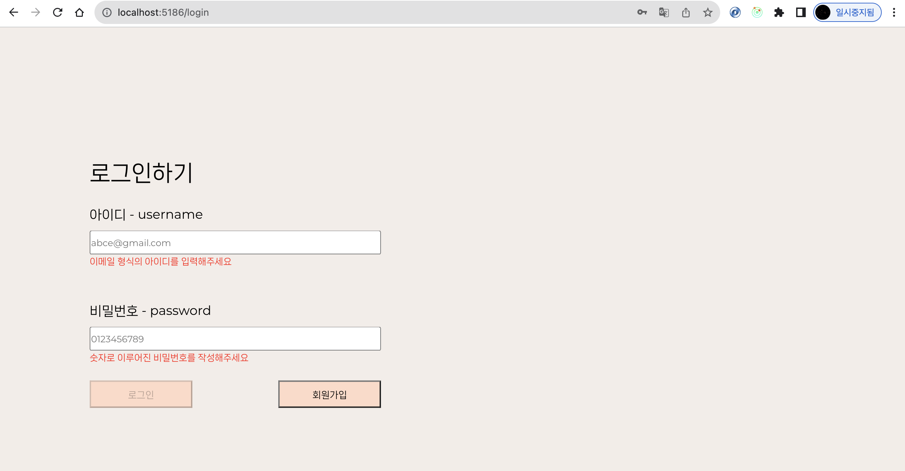
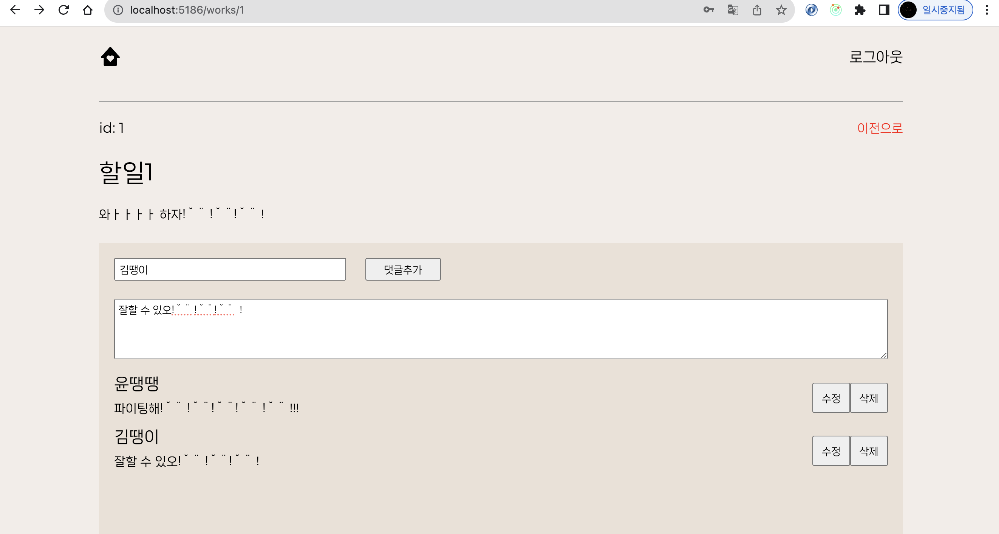

# 투두리스트 업그레이드 버전

기존에 비동기 통신이 없던 투두리스트를 업그래이드시킴. 비동기통신 연습 목적.
로그인과 회원가입은 실제 서버와 연동했고, 나머지는 mock server (json-server)와 연동했다.

## 사용 언어

- js
- react
- vite+yarn

## 사용 라이브러리

- react-query
- axios
- json-server
- react-router-dom
- scss
- react-redux
- @reduxjs/toolkit
- react-icons

## 기능

- 회원가입 (axios post) -JWT
- 로그인 (axios post) -JWT
- todo조회 (axios get)
- todo추가 (axios post)
- todo수정 (axios patch)
- todo삭제 (axios delete)
- 각각의 todo마다 댓글 기능 구현 (추가, 삭제, 조회, 수정)
- scss사용하여 스타일링 (mixin, vars, reset)

---

## 배포 url

## 미리보기

</img>
</img>

---

### 1. 특정 유저 (예: 비로그인 유저)의 페이지 접근을 제한하기 위한 전략이나 방식은 무엇이었나요?

세션에 토큰이 없다면 로그인페이지로 랜딩 바꿔주기

```
 useEffect(() => {
    if (!sessionStorage.token) {
      return navigate("/login");
    }
  }, []);
```

### 2. API 요청과 같은 비동기 작업 중 발생할 수 있는 에러에 대비해 에러 핸들링을 구현하셨나요?구현했다면, 어떠한 방법을 사용하셨나요?

try catch문으로 에러 헨들링

```
const loginUser = async ({ id, pw }) => {
  try {
    const res = await axios.post(
      `${import.meta.env.VITE_APP_MOCK_SERVER}/login`,
      {
        id: id,
        password: pw,
      }
    );
    const token = res.data.token;
    sessionStorage.setItem("token", token);

    alert("로그인에 성공하였습니다. ");
    return res.status;
  } catch (error) {
    alert(error.response.data.message);
  }
};

```

### 3. Redux toolkit의 Thunk 미들웨어를 활용하였나요? 활용했다면, thunk가 필요한 이유를 설명해 주세요.

thunk 보다는 react Query를 사용...

리액트 쿼리: 상태 관리와 비동기 데이터 로딩을 쉽게 처리하기 위한 라이브러리

미들웨어 : Axios나 fetch API는 단순히 HTTP 요청을 보내고 받는 역할을 하지만, 리액트 Query는 이를 훨씬 더 추상화하고 편리하게 다룰 수 있다.

장점:
상태 관리 용이 - 전역상태를 효과적으로 관리해서 컴포넌트 간에 쉽게 공유
에러 처리의 용이 - 데브툴 제공
isLoading, isError등의 통신 상태 관리 용이 - 보일러플레이트

### 4. JWT 토큰은 무엇인가요?

- 웹에서 정보를 안전하게 전송하기 위해 정의된 토큰 기반의 표준
- JWT는 특히 사용자 인증과 관련된 정보를 토큰 형태로 안전하게 전달할 때 자주 사용
- 구조: Header, Payload, Signiture

### 5.상태관리 ( 유지 / 초기화 ) 가 잘 되어있나요?

이 부분이 안되었다. 기술매니저님 호출 예정

### 6. 각 컴포넌트의 재사용성이 높나요?

로그인페이지와 회원가입이 동일한 컴포넌트 사용,
디테일페이지와 데테일 수정 페이지가 동일한 컴포넌트 사용,

### 7. 예외처리가 미흡한 부분은 없나요?

try catch문으로 처리했다. 혹은 mutation에 onSuccess, onError를 사용하거나 리액트쿼리의 isLoading, isError를 사용했다.

### 8. Form에 유효성 검증 기능을 적용

```
//유효성검증
    if (
      plan.name.length > 5 ||
      plan.title.length > 50 ||
      plan.content.length > 200
    ) {
      setName("");
      setTitle("");
      setContent("");
      return alert("글자 수 조건을 맞춰서 다시 입력해 주세요");
    } else {
      //쿼리 mutation 사용 -> plan을 전달.
      addPlanMutation.mutate(plan);
    }
```

### 9. Custom Hook을 구현하실 때 어떤 기능을 위해 사용하셨나요? 또한 Custom Hook을 사용함으로써 어떤 이점을 얻으셨나요?

아직 안했다. 이제 할 예정

### 10. API 서버의 URL을 `.env` 파일을 사용하여 숨기는 이유는 무엇일까요?

보안과 환경 관리 때문

- 보안: 중요정보 (API키, 토큰, DB연결 관련)을 소스코드에서 분리해서 노출을 안시키기 위해 (+ 깃허브에 안올리기 위해)
- 유지보수 : 필요할 때 .env만 수정하면 됨

### 11. 애플리케이션의 상태 값들을 컴포넌트 간 어떤 방식으로 공유하셨나요?

취지는 redux를 사용해보고 싶었지만,, 하다보니 props로 상태관리를 하고 있었다. 시간나면 RTK로 변경 예정
